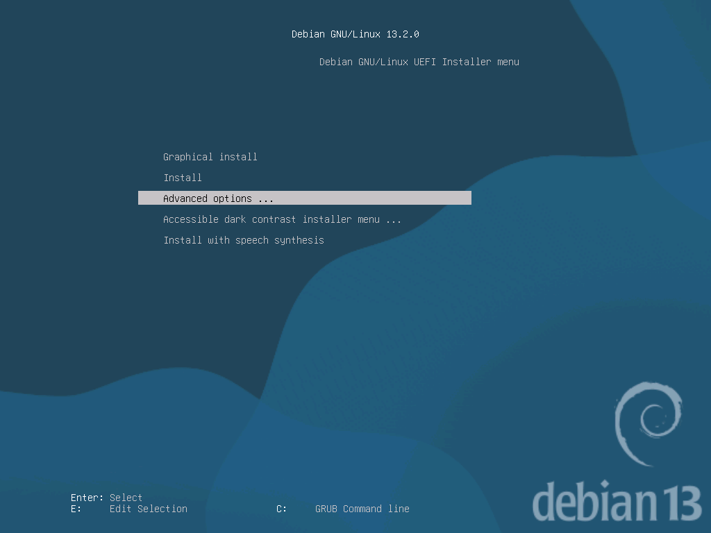
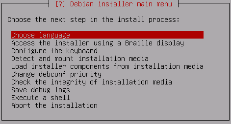

# Installer Debian 13

Démarrer sur l'iso _debian-13.3.0-amd64-netinst.iso_

### Debian GNU/Linux UEFI Installer menu

Advanced options ...

... Expert install



### Debian installer main menu

#### Choose language

- Select a language : ___French - Français___
- Choix de votre situation géographique
  - Pays (territoire ou région) : ___France___
- Choix des paramètres régionaux (locales)
  - Pays qui servira de base aux paramètres régionaux par défaut : ___France fr_FR.UTF-8___
- Paramètres régionaux supplémentaires :
  - Ne rien sélectionner (Continuer)



### Menu princinpal du programme d'installation Debian

#### Accès à l'installateur avec une plage braille

- Ne pas faire, sauter l'étape

#### Configurer le clavier

- Disposition du clavier à utiliser : ___Français___

#### Détection et montage du support d'installation

Un lecteur a été identifié et ce lecteur contient Debian GNU/Linux 13.2.0 "Trixie" - Official amd64 NETINST with firmware 20251115-11:04

- Continuer

#### Charger des composants depuis le support d'installation

- Ne rien sélectionner (Continuer)

#### Détecter le matériel réseau

#### Configurer le réseau

- Faut-il configurer le réseau automatiquement ? : ___Oui___
- Délai d'attente (en secondes) pour la détection du réseau : ___3___
- Nom de la machine :
- Domaine :

#### Créer les utilisateurs et choisir les mots de passe

- Faut-il autoriser les connexions du superutilisateur ?
___Oui___
- Faut-il créer un compte d'utilisateur ordinaire maintenant ?
___Non___

#### Configurer l'horloge

- Faut-il utiliser NTP pour régler l'horloge ?
___Oui___
- Fuseau horaire :
___Europe/Paris___

#### Détecter les disques

#### Partionnner les disques

Assisté - utiliser un disque entier :
___SCSI1 (0,0,0) (sda)___

Schéma de partitionnement
Tout dans une seule partition (recommandé pour les débutants)

Terminer le partitionnement et appliquer les changements

Faut-il appliquer les changements sur les disques ?
___Oui___

#### Installer le système de base

- Noyau à installer
___linux-image-amd64___

- Pilotes à inclure sur l'image disque en mémoire ( initrd ) :
___image ciblée : seulement les pilotes nécessaires pour ce système___

#### Configurer l'outil de gestion des paquets

- Faut-il analyser d'autres supports d'installation ?
___Non___
- Faut-il utiliser un miroir sur le réseau ?
___Oui___
- Protocole de téléchargement des fichiers :
___http___
- Souhaitez-vous utiliser des microprogrammes non libres ?
___Oui___
- Souhaitez-vous utiliser des logiciels non libres ?
___Oui___
- Activer les dépôts source dans APT ?
___Non___


Services à utiliser :

- mises à jour de sécurité (security.debian.org)
- mises à jour de la publication

#### Choisir et installer des logiciels

Gestion des mises à jour sur ce système :
___Installation automatique des mises à jour de sécurité___

Sélection des logiciels : ___Tout décocher___ (continuer)

#### Installer le programme de démarrage GRUB

- Faut-il forcer l'installation sur le chemin des supports amovibles EFI ?
___Non___
- Faut-il mettre à jour les variables dans la mémoire non volatile pour démarrer Debian automatiquement ?
___Oui___
- Faut-il exécuter os-prober automatiquement pour détecter et amorcer d'autres systèmes ?
___Non___

#### Terminer l'installation

L'horloge système est-elle à l'heure universelle (UTC) ?
_Oui_

Veuillez sélectionner <Continuer> pour redémarrer.
___Continuer___

### Configuration après premier démarrage

éditer le fichier `.bashrc`

```
PS1='${debian_chroot:+($debian_chroot)}\[\033[01;32m\]\u@\h\[\033[00m\]:\[\033[01;34m\]\w \$\[\033[00m\] '
```

# Raspberry

Raspberry Pi OS (anciennement nommé Raspbian) est un système d'exploitation basé sur Debian. Il est optimisé pour fonctionner sur les différents Raspberry Pi.

### Utilisation de Raspberry Pi Imager

<kbd>Ctrl</kbd> + <kbd>Shift</kbd> + <kbd>X</kbd>

Définir nom d'utilisateur et mot de passe

Définir les réglages locaux
- Fuseau horaire : ***Europe/Paris***
- Type de clavier : ***fr***

Services
- Activer SSH

### Configuration après premier démarrage

```shell
sudo dpkg-reconfigure locales
```
